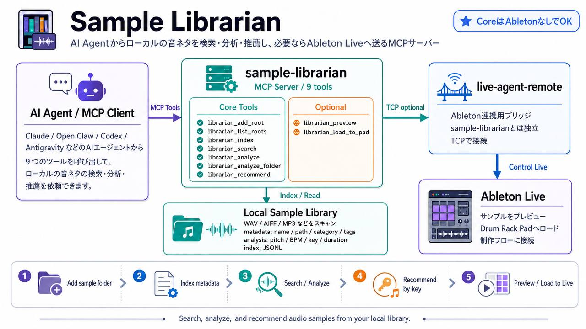

<p align="center">
  
</p>

# Sample Librarian

Search, analyze, and recommend audio samples from your local library.
Works standalone, or integrates with [live-agent-remote](https://github.com/happytown-s/live-agent-remote) for Ableton Live preview.

## Features

- **Manage Roots** — Add sample folders to config with auto re-index
- **Index** — Scan any sample folder, extract metadata (category, tags, file info)
- **Search** — Keyword search with scoring (name > category > tags > content)
- **Analyze** — librosa-based pitch detection, BPM, key estimation
- **Recommend** — Camelot Wheel harmonic matching for key-compatible samples
- **Ableton Integration** *(optional)* — Preview samples in Live, load onto Drum Rack pads

## Architecture

```
                    ┌──────────────────────────┐
  AI Agent          │   sample-librarian       │
    │               │   MCP Server (9 tools)   │
    ├── librarian_search        ──┐            │
    ├── librarian_add_root        │ Core (standalone)
    ├── librarian_list_roots      │            │
    ├── librarian_analyze         │            │
    ├── librarian_recommend       │            │
    ├── librarian_preview ────────┤            │
    └── librarian_load_to_pad     │ Optional   │
                                 ──┘           │
                    └──────────┬───────────────┘
                               │ TCP (optional)
                    ┌──────────▼───────────────┐
                    │   live-agent-remote      │
                    │   (Ableton Live)         │
                    └──────────────────────────┘
```

**Core tools work without Ableton.** Integration tools gracefully detect
whether LiveAgent is running and provide helpful setup messages if not.

## Quick Start

```bash
# Setup
git clone https://github.com/happytown-s/sample-librarian.git
cd sample-librarian
bash setup.sh

# Add sample folders (auto-indexes on add)
.venv/bin/python3 -c "from mcp_server import librarian_add_root; print(librarian_add_root('~/Music/Ableton/User Library/Samples'))"

# Or build index manually
.venv/bin/python3 -m librarian.index --root ~/path/to/samples

# Search
.venv/bin/python3 -m librarian.search dark bass

# Recommend key-compatible samples
.venv/bin/python3 -m librarian.recommend Fm kick --analyze
```

## MCP Server (for AI Agents)

### Hermes Agent

Add to `~/.hermes/profiles/<profile>/config.yaml`:

```yaml
mcp_servers:
  librarian:
    command: /path/to/sample-librarian/.venv/bin/python3
    args: [/path/to/sample-librarian/mcp_server.py]
```

### Other MCP Clients

Point your MCP client to:
```
Command: /path/to/sample-librarian/.venv/bin/python3
Args: [/path/to/sample-librarian/mcp_server.py]
```

## MCP Tools (9 total)

### Core (always available)

| Tool | Description |
|------|-------------|
| `librarian_search` | Search index by keywords, category, extension |
| `librarian_add_root` | Add folder to config + auto re-index |
| `librarian_list_roots` | Show configured roots and index status |
| `librarian_index` | Build/rebuild sample index from folders |
| `librarian_analyze` | Analyze file: pitch, BPM, key, duration |
| `librarian_analyze_folder` | Batch analyze folder (sorted by pitch) |
| `librarian_recommend` | Camelot Wheel key-compatible recommendations |

### Optional Integration (requires live-agent-remote)

| Tool | Description |
|------|-------------|
| `librarian_preview` | Import sample as audio clip in Ableton Live |
| `librarian_load_to_pad` | Load sample onto Drum Rack pad |

Integration tools auto-detect if LiveAgent is running. If not available,
they return a helpful error with setup instructions — the core tools
remain fully functional.

## Using with live-agent-remote

These two projects are **independent but complementary**:

| Project | Role |
|---------|------|
| **sample-librarian** | Search, analyze, recommend samples |
| **live-agent-remote** | Control Ableton Live (MIDI, clips, devices) |

Register both MCP servers in your AI agent config:

```yaml
mcp_servers:
  liveagent:
    command: /path/to/live-agent-remote/.venv/bin/python3
    args: [/path/to/live-agent-remote/mcp_server.py]
  librarian:
    command: /path/to/sample-librarian/.venv/bin/python3
    args: [/path/to/sample-librarian/mcp_server.py]
```

### Typical Workflow

```
0. librarian_add_root("~/Music/Ableton/User Library/Samples")  → register folder + auto index
1. librarian_recommend("Fm", category="Kick")     → get compatible kicks
2. librarian_preview("/path/to/kick.wav")          → preview in Ableton
3. librarian_load_to_pad("/path/to/kick.wav", ...) → load onto Drum Rack
4. mcp_liveagent_write_midi_notes(...)              → write drum pattern
```

## Configuration

Edit `config.local.py` (gitignored):

```python
# Required: sample folders to index
SAMPLES_ROOTS = [
    "~/Music/Ableton/User Library/Samples",
    "/path/to/your/sample/library",
]

# Optional: LiveAgent integration
LIVEAGENT_HOST = "127.0.0.1"
LIVEAGENT_PORT = 8765
```

Or use environment variables:

```bash
export SAMPLES_PATH="/path/to/samples"
export LIVEAGENT_HOST=127.0.0.1
export LIVEAGENT_PORT=8765
```

## Camelot Wheel Harmonic Matching

Recommendations use the Camelot Wheel system:

| Key | Camelot | Compatible With |
|-----|---------|-----------------|
| Fm  | 4B      | Ebm(3B), C#m(5B), F(4A) |
| C   | 8A      | F(7A), G(9A), Am(8B) |

**Rules:**
- Same number, same letter (perfect match)
- Adjacent number ±1, same letter (smooth transition)
- Same number, opposite letter (relative major/minor)
- Atonal samples (hi-hats, noise) always included

## CLI Usage

```bash
# Index
python3 -m librarian.index --root ~/samples --root ~/more/samples
python3 -m librarian.index --query bass --query dark

# Search
python3 -m librarian.search dark bass --limit 10
python3 -m librarian.search 808 kick --category Kick --json

# Analyze
python3 -m librarian.analyze file.wav --mode full
python3 -m librarian.analyze ./folder/ --mode pitch

# Recommend
python3 -m librarian.recommend Fm kick --analyze
python3 -m librarian.recommend C --category Bass
```

## Requirements

- Python 3.10+
- librosa, numpy, scipy, soundfile (auto-installed by setup.sh)
- mcp (for MCP server)
- Optional: [live-agent-remote](https://github.com/happytown-s/live-agent-remote) for Ableton integration

## License

MIT
