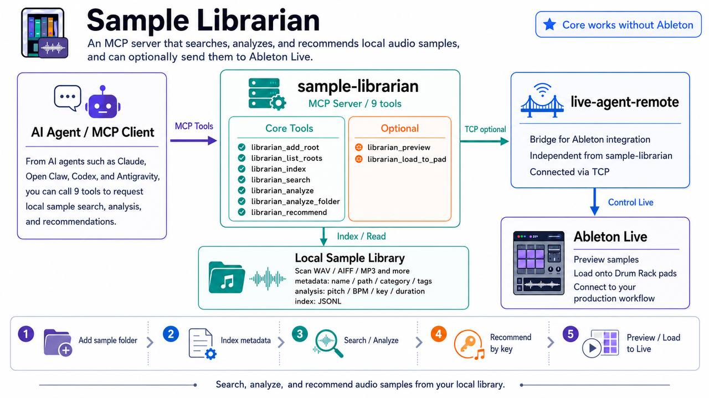

<p align="center">
  
</p>

<p align="center">
  <a href="README.md">English</a> |
  <a href="README.jp.md">日本語</a> |
  <a href="README.zh.md">中文</a> |
  <a href="README.kr.md">한국어</a> |
  <a href="README.es.md">Español</a> |
  <a href="README.fr.md">Français</a>
</p>

# Sample Librarian

Search, analyze, and recommend audio samples from your local library.
SQLite + FTS5 full-text search, AI-friendly result enrichment, duplicate
detection, and Camelot Wheel harmonic matching. Works standalone, or
integrates with [live-agent-remote](https://github.com/happytown-s/live-agent-remote)
for Ableton Live preview and one-shot Drum Rack building.

## Features

- **Manage Roots** — Add sample folders to config with auto re-index
- **Index** — Scan folders, extract metadata, store in SQLite with FTS5
- **Search** — BM25 full-text search across name, category, tags, and folder paths
- **Enriched Results** — Each search result includes `key`, `bpm`, `pitch`, `confidence`, `recommended_use`, and `ableton_action` — ready for AI agents to act on
- **Analyze** — librosa-based pitch detection, BPM, key estimation, spectral analysis
- **Duplicate Detection** — Find duplicates across 4 axes: content hash, duration, pitch, and spectral fingerprint
- **Recommend** — Camelot Wheel harmonic matching for key-compatible samples
- **One-Shot Drum Rack** — `build_drum_rack_for_key()` searches compatible samples, creates a Drum Rack track, loads kick/snare/hat onto pads, and writes a MIDI pattern — all in one call
- **Ableton Integration** *(optional)* — Preview samples in Live, load onto Drum Rack pads, with TCP session management and undo groups

## Architecture

```
                    ┌──────────────────────────────────┐
  AI Agent          │   sample-librarian               │
    │               │   MCP Server (9 tools)           │
    │               │                                  │
    ├── librarian_search ──────────┐                   │
    ├── librarian_add_root          │ Core (standalone) │
    ├── librarian_list_roots        │                   │
    ├── librarian_index             ▼                   │
    ├── librarian_analyze      ┌─────────────┐          │
    ├── librarian_analyze_folder│  SQLite +   │          │
    ├── librarian_recommend     │  FTS5 (BM25)│          │
    │                           └─────────────┘          │
    ├── librarian_preview ──────┐                       │
    └── librarian_load_to_pad   │ Optional              │
                                │                       │
              build_drum_rack_for_key()                 │
              (Python API, not MCP tool)                │
                                │                       │
                    ┌──────────▼───────────────────────┐
                    │   live-agent-remote              │
                    │   LiveAgentClient (TCP 8765)     │
                    │   batch() / undo_group()         │
                    │   (Ableton Live)                 │
                    └──────────────────────────────────┘
```

**Core tools work without Ableton.** Integration tools gracefully detect
whether LiveAgent is running and provide helpful setup messages if not.

## Quick Start

```bash
# Setup
git clone https://github.com/happytown-s/sample-librarian.git
cd sample-librarian
bash setup.sh

# Add sample folders (auto-indexes on add)
.venv/bin/python3 -c "from mcp_server import librarian_add_root; print(librarian_add_root('~/Music/Ableton/User Library/Samples'))"

# Or build index manually
.venv/bin/python3 -m librarian.index --root ~/path/to/samples

# Search
.venv/bin/python3 -m librarian.search dark bass

# Recommend key-compatible samples
.venv/bin/python3 -m librarian.recommend Fm kick --analyze
```

## Database

Sample Librarian uses **SQLite with FTS5** (BM25 full-text search) as its
primary index. On first run, existing JSONL indexes are automatically
migrated to SQLite.

**Schema highlights:**
- `samples` — file metadata (path, name, category, size, hash)
- `analysis_cache` — pitch, BPM, key, duration, spectral data
- `tags` — searchable tag associations
- `roots` — registered sample folders with scan history
- `samples_fts` — FTS5 virtual table for BM25 search

**AI-friendly enrichment** (`enrich_result()`): every search result is
augmented with:

| Field | Description |
|-------|-------------|
| `key` | Detected musical key |
| `bpm` | Detected tempo |
| `pitch` | Fundamental pitch (note name + number) |
| `sample_type` | oneshot / short_loop / medium_loop / long_loop |
| `is_atonal` | True for non-pitched samples (hi-hats, noise) |
| `confidence` | Heuristic score 0.0–1.0 based on analysis completeness |
| `recommended_use` | How to use this sample (e.g., "drum_kit_kick") |
| `ableton_action` | Suggested LiveAgent call (e.g., `load_sample_to_pad`) |
| `compatible_keys` | Harmonically compatible keys via Camelot Wheel |

## Duplicate Detection

Find redundant samples across four independent axes:

| Function | Method | Use Case |
|----------|--------|----------|
| `find_duplicates_by_hash()` | Content hash (identical files) | Exact duplicates |
| `find_similar_by_duration()` | Duration within tolerance + same category | Potential re-exports |
| `find_similar_by_pitch()` | Same pitch class + same category | Tonal overlap |
| `find_similar_by_spectral()` | Spectral centroid similarity | Same character/timbre |
| `find_all_duplicates()` | All of the above combined | Full audit |

## One-Shot Drum Rack (`build_drum_rack_for_key()`)

The orchestration API that ties everything together:

```python
from librarian.live_agent_bridge import build_drum_rack_for_key

result = build_drum_rack_for_key(
    key="Fm",                    # target key
    track_index=-1,              # append to end of track list
    host="127.0.0.1",            # LiveAgent host
    port=8765,                   # LiveAgent port
)
```

This single call:
1. Searches the SQLite index for key-compatible kick, snare, and hi-hat samples
2. Creates a Drum Rack track in Ableton Live (default: 808 Core Kit)
3. Loads samples onto pads 36 (kick), 38 (snare), 42 (closed hat)
4. Optionally writes a basic MIDI drum pattern
5. Returns loaded sample paths for verification

See `docs/recipes.md` for detailed usage.

## MCP Server (for AI Agents)

### Hermes Agent

Add to `~/.hermes/profiles/<profile>/config.yaml`:

```yaml
mcp_servers:
  librarian:
    command: /path/to/sample-librarian/.venv/bin/python3
    args: [/path/to/sample-librarian/mcp_server.py]
```

### Other MCP Clients

Point your MCP client to:
```
Command: /path/to/sample-librarian/.venv/bin/python3
Args: [/path/to/sample-librarian/mcp_server.py]
```

See `docs/mcp-clients.md` for Claude Desktop, Cursor, and other clients.

## MCP Tools (9 total)

### Core (always available)

- `librarian_search` — Search index by keywords, category, extension
- `librarian_add_root` — Add folder to config + auto re-index
- `librarian_list_roots` — Show configured roots and index status
- `librarian_index` — Build/rebuild sample index from folders
- `librarian_analyze` — Analyze file: pitch, BPM, key, duration
- `librarian_analyze_folder` — Batch analyze folder (sorted by pitch)
- `librarian_recommend` — Camelot Wheel key-compatible recommendations

### Optional Integration (requires live-agent-remote)

- `librarian_preview` — Import sample as audio clip in Ableton Live
- `librarian_load_to_pad` — Load sample onto Drum Rack pad

Integration tools auto-detect if LiveAgent is running. If not available,
they return a helpful error with setup instructions — the core tools
remain fully functional.

## Using with live-agent-remote

These two projects are **independent but complementary**:

- **sample-librarian** — Search, analyze, recommend samples
- **live-agent-remote** — Control Ableton Live (MIDI, clips, devices)

Register both MCP servers in your AI agent config:

```yaml
mcp_servers:
  liveagent:
    command: /path/to/live-agent-remote/.venv/bin/python3
    args: [/path/to/live-agent-remote/mcp_server.py]
  librarian:
    command: /path/to/sample-librarian/.venv/bin/python3
    args: [/path/to/sample-librarian/mcp_server.py]
```

### Typical Workflow

```
0. librarian_add_root("~/Music/Ableton/User Library/Samples")  → register + index
1. librarian_recommend("Fm", category="Kick")     → compatible kicks
2. librarian_preview("/path/to/kick.wav")          → preview in Ableton
3. librarian_load_to_pad("/path/to/kick.wav", ...) → load onto Drum Rack
4. mcp_liveagent_write_midi_notes(...)              → write drum pattern

# Or do 1-4 in one shot:
build_drum_rack_for_key(key="Fm")  → search + create + load + MIDI
```

## Configuration

Edit `config.local.py` (gitignored):

```python
# Required: sample folders to index
SAMPLES_ROOTS = [
    "~/Music/Ableton/User Library/Samples",
    "/path/to/your/sample/library",
]

# Optional: LiveAgent integration
LIVEAGENT_HOST = "127.0.0.1"
LIVEAGENT_PORT = 8765
```

Or use environment variables:

```bash
export SAMPLES_PATH="/path/to/samples"
export LIVEAGENT_HOST=127.0.0.1
export LIVEAGENT_PORT=8765
```

## Camelot Wheel Harmonic Matching

Recommendations use the Camelot Wheel system:

- Same number, same letter — perfect match
- Adjacent number ±1, same letter — smooth transition
- Same number, opposite letter — relative major/minor
- Atonal samples (hi-hats, noise) always included

## CLI Usage

```bash
# Index
python3 -m librarian.index --root ~/samples --root ~/more/samples
python3 -m librarian.index --query bass --query dark

# Search
python3 -m librarian.search dark bass --limit 10
python3 -m librarian.search 808 kick --category Kick --json

# Analyze
python3 -m librarian.analyze file.wav --mode full
python3 -m librarian.analyze ./folder/ --mode pitch

# Recommend
python3 -m librarian.recommend Fm kick --analyze
python3 -m librarian.recommend C --category Bass

# Database (duplicate detection, migration)
python3 -m librarian.db --duplicates
python3 -m librarian.db --migrate data/samples_index.jsonl
python3 -m librarian.db --stats
```

## Documentation

- `docs/recipes.md` — Common workflows and code recipes
- `docs/security.md` — Security model and safe operations
- `docs/troubleshooting.md` — Debugging guide
- `docs/mcp-clients.md` — Setup for Claude Desktop, Cursor, and others

## Testing

```bash
.venv/bin/python3 -m pytest tests/ -v
```

22 tests covering database operations, search, analysis, and enrichment.
CI runs on GitHub Actions with ruff lint + pytest.

## Requirements

- Python 3.10+
- librosa, numpy, scipy, soundfile (auto-installed by setup.sh)
- mcp (for MCP server)
- Optional: [live-agent-remote](https://github.com/happytown-s/live-agent-remote) for Ableton integration

## License

MIT
